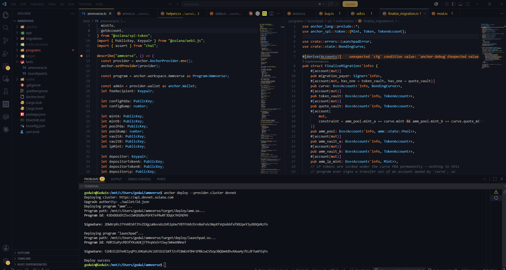
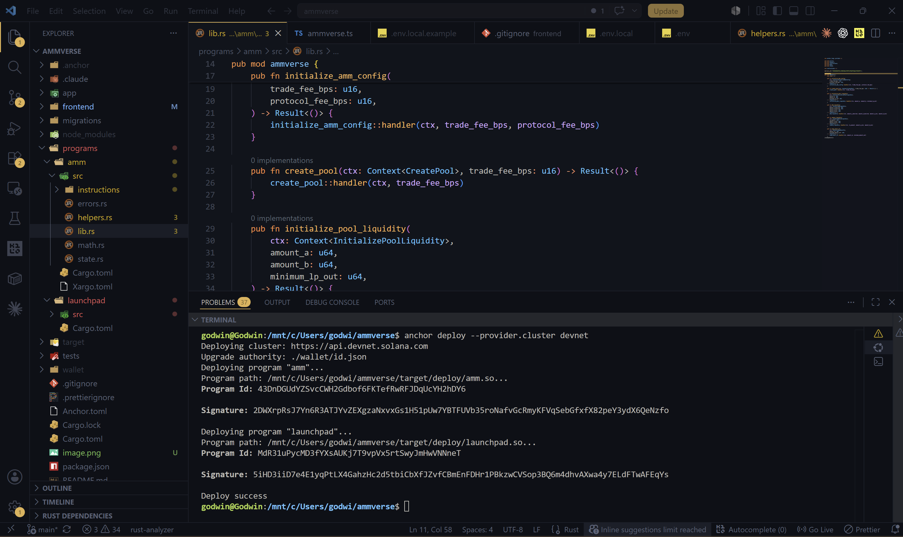

# Ammverse

A Solana Anchor workspace containing two on-chain programs that together form a pump.fun-style token launch system: a **launchpad** for bonding-curve token sales and an **AMM** that bonding curves migrate into once they hit a market cap target.

## Programs

### `launchpad` (`programs/launchpad`)

Bonding-curve token launches using a virtual/real reserves constant-product model (similar to pump.fun):

- `initialize_global_config` — sets platform fee, migration fee, and the market cap threshold required for migration.
- `create_launch` — creates a `BondingCurve` for a token with configurable virtual and real reserves and total supply.
- `buy` / `sell` — trade against the curve; price is computed via constant-product math (`x * y = k`) over `virtual + real` reserves, with a platform fee taken on quote amounts.
- `migrate_to_amm` — once a curve's market cap reaches the configured threshold, CPIs into the AMM program to create a real liquidity pool for the token, then marks the curve as `migrating`/`paused`.
- `finalize_migration` / `abort_migration` — complete or roll back an in-progress migration.
- `pause_launch` — admin control to pause/unpause a curve.

Core math lives in [programs/launchpad/src/math.rs](programs/launchpad/src/math.rs): `buy_quote`, `sell_quote`, `spot_price_scaled`, and `market_cap_scaled`.

### `amm` (`programs/amm`)

A standard constant-product AMM (via the `constant_product_curve` crate) that receives migrated tokens:

- `initialize_amm_config` — sets trade fee and protocol fee for the AMM instance.
- `create_pool` — creates a new `Pool` for a token pair (mint A / mint B) with its own vaults and LP mint.
- `initialize_pool_liquidity` — seeds initial liquidity and mints the initial LP supply (`sqrt(amount_a * amount_b)`).
- `add_liquidity` / `remove_liquidity` — proportional liquidity management with slippage-protecting minimums.
- `swap_exact_in` — constant-product swap in either direction with fee deduction.

Core math lives in [programs/amm/src/math.rs](programs/amm/src/math.rs).

## How they connect

`launchpad::migrate_to_amm` performs a CPI into `amm::create_pool`, so a successful bonding-curve launch graduates into a real, tradeable liquidity pool without manual intervention. Program IDs are wired together in [Anchor.toml](Anchor.toml):

- `amm` → `43DnDGUdYZSvcCWH2Gdbof6FKTefRwRFJDqUcYH2hDY6`
- `launchpad` → `MdR31uPycMD3fYXsAUKj7T9vpVx5rtSwyJmHwVNNneT`

## Tech stack

- Anchor (`@coral-xyz/anchor` 0.31) / Rust on-chain programs
- TypeScript tests via `ts-mocha` + `chai` ([tests/ammverse.ts](tests/ammverse.ts), [tests/launchpad.ts](tests/launchpad.ts))
- `@solana/spl-token` for token account/mint helpers

godwin@Godwin:/mnt/c/Users/godwi/ammverse$ anchor deploy --provider.cluster devnet
Deploying cluster: https://api.devnet.solana.com
Upgrade authority: ./wallet/id.json
Deploying program "amm"...
Program path: /mnt/c/Users/godwi/ammverse/target/deploy/amm.so...
Program Id: 43DnDGUdYZSvcCWH2Gdbof6FKTefRwRFJDqUcYH2hDY6

Signature: 2DWXrpRsJ7Yn6R3ATJYvZEXgzaNxvxGs1H51pUw7YBTFUVb35roNafvGcRmyKFVqSebGfxfX82peY3ydX6QeNzfo

Deploying program "launchpad"...
Program path: /mnt/c/Users/godwi/ammverse/target/deploy/launchpad.so...
Program Id: MdR31uPycMD3fYXsAUKj7T9vpVx5rtSwyJmHwVNNneT

Signature: 5iHD3iiD7e4E1yqPtLX4GahzHc2d5tbiCbXfJZvfCBmEnFDHr1PBkzwCVSop3BQ6m4dhvAXwa4y7ELdFTwAFEqYs

Deploy success

Tests run against a local validator (`cluster = "localnet"` in [Anchor.toml](Anchor.toml)) using the wallet at `./wallet/id.json`.

## Frontend

[frontend/](frontend/) is a Next.js dApp for both programs (wallet connect, launch/pool creation, buy/sell, swap, liquidity, migration). See [frontend/README.md](frontend/README.md) for setup.
